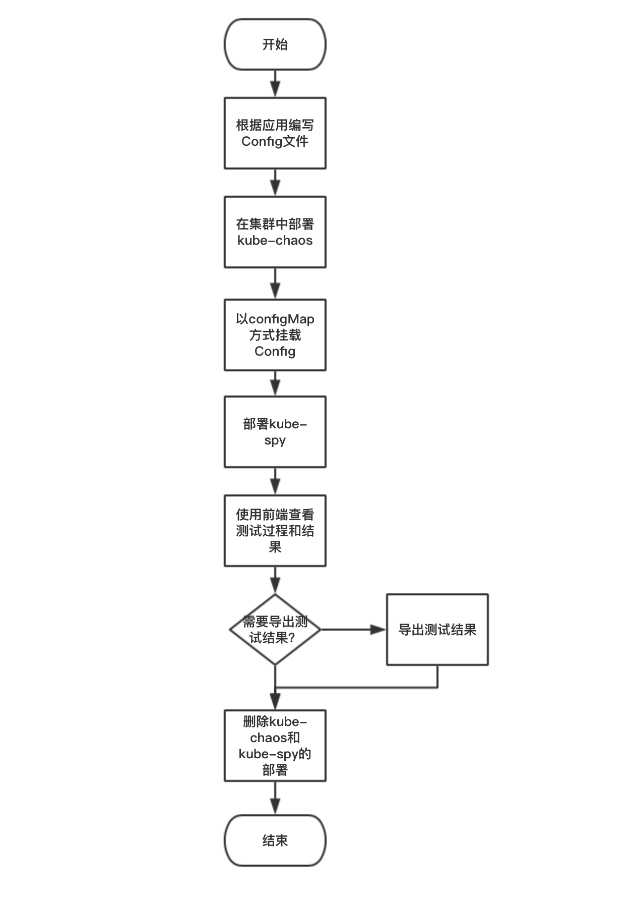

# kube-spy

## Config格式
> "**\***"注明的选项为可选项

### `namespace` 命名空间
#### 样例

```
# Your services' namespace in kubernetes
Namespace: "default"
```
#### 结构
```
Namespace      string          `yaml:"Namespace"`
```
#### 参数说明

`namespace`用于指定被测试应用在集群中所在的namespace，目前一次测试只支持在一个命名空间内的应用。

### `VictimServices` 服务列表
#### 样例

```
# Your services and it's chaos list
VictimServices:
- name: "http-test-service1"
  ChaosList:
  - replica: 1
    ingress: ",delay,50ms"
    egress: ",delay,50ms"
- name: "http-test-service2"
  ChaosList:
  - ingress: ",delay,50ms"
    egress: ",delay,50ms"
    replica: 1
    range: 1
- name: "http-test-service3"
  ChaosList:
  - ingress: ",delay,50ms"
    egress: ",delay,50ms"
```
#### 结构
```
struct {
	Name      string  `yaml:"name"`
	ChaosList []Chaos `yaml:"ChaosList"`
}
```
#### 参数说明
本列表用于指定将被用于测试的服务，测试按照列表顺序进行，每个服务分为有`name`和`chaosList`两项参数，`name`指定该服务在Kubernetes集群中的service名，而\*`chaosList`指定在该服务上注入的故障列表。

*`chaosList`上可以有任意项，每一项有四个参数：

```
struct {
	Replica int    `yaml:"replica"`
	Range   string `yaml:"range"`
	Ingress string `yaml:"ingress"`
	Egress  string `yaml:"egress"`
}
```

* *`replica`指定这个服务所对应的deployment的副本数，可以用这个参数来进行副本数伸缩测试，0或不填代表不进行副本数控制；副本数控制只在测试中生效，该项测试完毕后副本数会立刻恢复到原副本数。

* *`ingress`和\*`egress`分别指定该服务所对应Pod上的入境流量和出境流量的故障参数，故障参数的格式参见本文档故障参数部分。

* *`range`指定被注入故障的pod个数或者百分比（占服务内pod数量百分比），这里的服务一被指定了两个副本数，`range`为50%则将有1个pod被注入故障。需要注意的是，指定`range`时不一定需要指定`replica`。

### *`APISetting` API全局设置
```
# Every request will carry them, and they can be overridden
APISetting:
  authToken: "BC594900518B4F7EAC75BD37F019E08FBC594900518B4F7EAC75BD37F019E08F"
  headers:
    Content-Type: "application/json"
```
在这里可以为所有API测试用例进行设置，比如设置权限认证，或者请求头等，本参数格式与单个的测试用例相同，详见本节`TestCases`部分。

如果在随后的测试用例中有与本设置冲突的参数，则优先使用测试用例中的设置。在每个测试用例组中也可以设置本参数，在发生冲突时，它们的优先级是`单个测试用例>组设置>全局设置`。

### *`ClientSetting` 客户端全局设置
#### 样例
```
# Client retry settings
ClientSetting:
  retryCount: 0
  retryWait: 1000
  retryMaxWait: 1000
  timeout: 3000

```
#### 结构
```
struct {
	RetryCount   int `yaml:"retryCount"`
	RetryWait    int `yaml:"retryWait"`
	RetryMaxWait int `yaml:"retryMaxWait"`
	Timeout      int `yaml:"timeout"`
}
```
本参数设置http测试用客户端的重试和超时设置，其中：

* *`retryCount`指定重试次数，非零时客户端在请求超时后会进行指定次的重试，指定为零或不指定时不进行重试；
* *`retryWait`指定初始重试间隔，为零或不指定时使用默认间隔，测试客户端使用[backoff](http://www.awsarchitectureblog.com/2015/03/backoff.html)重试策略，在每次重试时增加等待时间，本参数指定的是第一次重试的等待时间；
* *`retryMaxWait`指定最长等待时间，[backoff](http://www.awsarchitectureblog.com/2015/03/backoff.html)重试策略，在每次重试时增加等待时间，使用本参数可以限制[backoff](http://www.awsarchitectureblog.com/2015/03/backoff.html)策略不断增加的等待时间的最大值；
* *`timeout`指定单次请求的超时时间，为零或不指定时使用默认设置。


### `TestCaseLists` 测试用例列表组
#### 样例
```
# These test case will be tested in every loop
TestCaseLists:
- service: "http-test-service1"
  host: "httpbin.org"
  TestCases:
  - method: "GET"
    url: "/"
```
#### 结构
```
struct {
	Service       string        `yaml:"service"`
	Host          string        `yaml:"host"`
	APISetting    TestCase      `yaml:"APISetting"`
	ClientSetting ClientSetting `yaml:"ClientSetting"`
	TestCases     []TestCase    `yaml:"TestCases"`
}
```
#### 参数说明
本参数可以指定多个测试用例组，每个组可以有独立的service/host、APISetting和ClientSetting,以及对应的测试用例列表，其中：

* *`service`或\*`host`二选一，指定本组测试用例的目标服务或域名/IP，填写`service`时，spy会自动找到该service在集群中的地址发起测试，而填写`host`时则直接使用该地址发起测试。`host`不需要`http://`前缀；
* *`APISetting`与全局的`APISetting`作用相同，在冲突时优先级比全局的设置更高，低于单个的测试用例的优先级；
* *`ClientSetting`与全局的`ClientSetting`作用相同，在冲突时优先级比全局的设置更高，低于单个的测试用例的优先级；
* `TestCases`测试用例列表，详细说明在下方单独列出。

### `TestCases`测试用例列表（属于`TestCaseLists`)
#### 结构
```
struct {
	Method    string            `yaml:"method"`
	URL       string            `yaml:"url"`
	Params    map[string]string `yaml:"params"`
	AuthToken string            `yaml:"authToken"`
	BasicAuth struct {
		Username string `yaml:"username"`
		Password string `yaml:"password"`
	} `yaml:"BasicAuth"`
	Headers     map[string]string   `yaml:"headers"`
	Form        map[string]string   `yaml:"form"`
	MultiForm   map[string][]string `yaml:"multiValueForm"`
	MultiParams map[string][]string `yaml:"multiValueParams"`
	Files       map[string]string   `yaml:"files"`
	PathParams  map[string]string   `yaml:"pathParams"`
	Body        string              `yaml:"body"`
}
```
#### 参数说明
##### `method`:
指定本条测试请求的HTTP方法，目前只支持`GET`,`PUT`,`POST`,`PATCH`,`DELETE`,`HEAD`,`OPTIONS`七种方法。

类型：`string`

样例：

`method: "GET"`
##### `url`:
指定本条测试请求的请求路径，从根开始。

类型：`string`

样例：

`url: "/users"`
##### *`params`:
指定本条测试请求的参数。

类型：`string`

样例：

```
params:
  data: "a"
```
##### *`authToken`:
指定本条测试请求的bearerAuth。

类型：`string`

样例：

`authToken: "C6A79608-782F-4ED0-A11D-BD82FAD829CD"`

##### *`BasicAuth`:
指定本条测试请求的basicAuth。

类型：

```
struct {
		Username string `yaml:"username"`
		Password string `yaml:"password"`
}
```

样例：

```
BasicAuth:
  username: "root"
  password: "123456"
```

##### *`headers`:
指定本条测试请求的请求头。

类型：`map[string]string`

样例：

```
headers:
  Content-Type: "application/json"
  User-Agent: curl/7.54.0    
```

##### *`form`:
指定本条测试请求的表单信息。

类型：`map[string]string`

样例：

```
form:
  first_name: "Linus"
  last_name:  "Torvalds"
```

##### *`multiValueForm`:
指定本条测试请求的多值表单。

类型：`map[string][]string`

样例：

```
multiValueForm:
  data:
  - "a"
  - "b"
  text:
  - "c"
```

##### *`multiValueParams`:
指定本条测试请求的请求头。

类型：`map[string][]string`

样例：

```
multiValueParams:
  data:
  - "a"
  - "b"
  text:
  - "c"
```

##### *`files`:
指定本条测试请求携带的文件。**使用本功能时需要将所需的文件挂载到kube-spy所在的pod。**

类型：`map[string]string`

样例：

```
files:
  1: "/Pictures/icon.png"
  2: "/tmp/spy.INFO"
```

##### *`pathParams`:
指定本条测试请求的路径参数，路径参数用于替换路径中的变量。

类型：`map[string]string`

样例：

```
url: "/base64/{value}"
pathParams:
  value: "a3ViZS1zcHk="
```
在`url`中使用`{}`包含的文本即为路径变量，可以被随后的`pathParams`中的对应同名键的对应值替换，在这个例子里`url`最终会被替换成`/base64/a3ViZS1zcHk=`

##### *`body`:
指定本条测试请求的请求体。

类型：`string`

样例：

```
body: "{ languages: [ 'Ruby', 'Perl', 'Python', 'c' ] }"
```

#### 附：测试用例演示

```
# Set request json body and headers
  - method: "GET"
    url: "/headers"
    headers:
      Content-Type: "application/json"
    body: "{ languages: [ 'Ruby', 'Perl', 'Python', 'c' ] }"

# Set form and files
  - method: "POST"
    url: "/post"
    form:
      first_name: "Linus"
      last_name:  "Torvalds"
    files:
      1: "/tmp/spy.INFO"
      2: "/tmp/spy.INFO"


# Set query params and bearer auth
  - method: "Get"
    url: "/get"
    params:
      data: "a"
    headers:
    authToken: "C6A79608-782F-4ED0-A11D-BD82FAD829CD"

# Set multi value form and params
  - method: "Post"
    url: "/post"
    multiValueForm:
      data:
      - "a"
      - "b"
      text:
      - "c"
    multiValueParams:
      data:
      - "a"
      - "b"
      text:
      - "c"

# Set path params
  - method: "Get"
    url: "/base64/{value}"
    pathParams:
      value: "a3ViZS1zcHk="

# Set basic auth
  - method: "get"
    url: "/"
    BasicAuth:
      username: "root"
      password: "123456"
```

## 故障参数说明
kube-spy与kube-chaos协作完成集群中pod的故障注入。

而kube-chaos通过Linux内核中内置的netem模块进行故障的注入，可以使用参数启用netem的所有功能。

kube-chaos的入境/出境流量故障参数分为两个部分，格式为:

`[rate],[netem arg1],[netem arg2],[netem arg3],...`

其中，`rate`指定速率限制，`netem arg`指定netem参数，样例：`10kbps,delay,100ms`

这个例子的效果是：限制带宽上限到10KB/s，并且每个数据包固定增加一个100ms的延迟。

### `rate`
可使用的速率单位：
				
	bit or a bare number	Bits per second
	kbit	Kilobits per second
	mbit	Megabits per second
	gbit	Gigabits per second
	tbit	Terabits per second
	bps		Bytes per second
	kbps	Kilobytes per second
	mbps	Megabytes per second
	gbps	Gigabytes per second
	
需要注意的是，限速的上限为4gibps,不支持更高的限速（由于内核中的限速速率由一个单位为bits/s的32位的无符号整数来储存）
>如果用IEC单位表示,则将SI的前缀（k-, m-, g-)替换为IEC的前缀(ki-, mi-, gi-)。
>
>另外也可以用一个百分数比如`50%`来表示占当前设备速率的百分比。

### `netem arg`
netem的参数详见本目录下另一个[文档](./netem.md)
## 流程图
### 用户部署流程图

### kube-spy执行流程图

