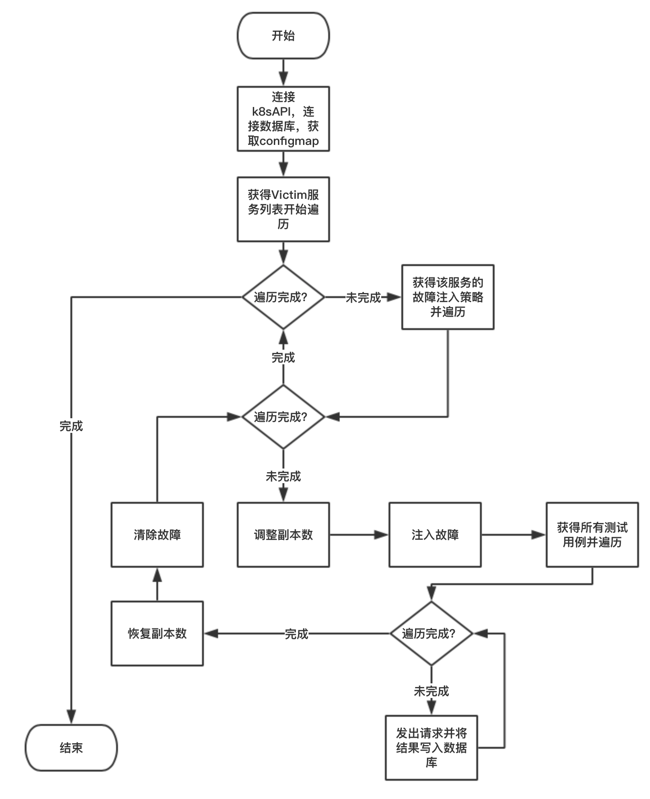

# kube-spy

## Config格式
> "**\***"注明的选项为可选项

### `namespace` 命名空间
#### 样例

```
# Your services' namespace in kubernetes
Namespace: "default"
```
#### 结构
```
Namespace      string          `yaml:"Namespace"`
```
#### 参数说明

`namespace`用于指定被测试应用在集群中所在的namespace，目前一次测试只支持在一个命名空间内的应用。

### `VictimServices` 服务列表
#### 样例

```
# Your services and it's chaos list
VictimServices:
- name: "http-test-service1"
  ChaosList:
  - replica: 1
    ingress: ",delay,50ms"
    egress: ",delay,50ms"
- name: "http-test-service2"
  ChaosList:
  - ingress: ",delay,50ms"
    egress: ",delay,50ms"
    replica: 1
    range: 1
- name: "http-test-service3"
  ChaosList:
  - ingress: ",delay,50ms"
    egress: ",delay,50ms"
```
#### 结构
```
struct {
	Name      string  `yaml:"name"`
	ChaosList []Chaos `yaml:"ChaosList"`
}
```
#### 参数说明
本列表用于指定将被用于测试的服务，测试按照列表顺序进行，每个服务分为有`name`和`chaosList`两项参数，`name`指定该服务在Kubernetes集群中的service名，而\*`chaosList`指定在该服务上注入的故障列表。

*`chaosList`上可以有任意项，每一项有四个参数：

```
struct {
	Replica int    `yaml:"replica"`
	Range   string `yaml:"range"`
	Ingress string `yaml:"ingress"`
	Egress  string `yaml:"egress"`
}
```

* *`replica`指定这个服务所对应的deployment的副本数，可以用这个参数来进行副本数伸缩测试，0或不填代表不进行副本数控制；副本数控制只在测试中生效，该项测试完毕后副本数会立刻恢复到原副本数。

* *`ingress`和\*`egress`分别指定该服务所对应Pod上的入境流量和出境流量的故障参数。

* *`range`指定被注入故障的pod个数或者百分比（占服务内pod数量百分比），这里的服务一被指定了两个副本数，`range`为50%则将有1个pod被注入故障。需要注意的是，指定`range`时不一定需要指定`replica`。

#### *`APISetting` API全局设置
```
# Every request will carry them, and they can be overridden
APISetting:
#  authToken: "BC594900518B4F7EAC75BD37F019E08FBC594900518B4F7EAC75BD37F019E08F"
#  headers:
#    Content-Type: "application/json"
```
在这里可以为所有API测试用例进行设置，比如设置权限认证，或者请求头等，本参数格式与单个的测试用例相同。

如果在随后的测试用例中有与本设置冲突的参数，则优先使用测试用例中的设置。在每个测试用例组中也可以设置本参数，在发生冲突时，它们的优先级是`单个测试用例>组设置>全局设置`

#### *`ClientSetting` 客户端全局设置
##### 样例
```
# Client retry settings
ClientSetting:
  retryCount: 0
  retryWait: 1000
  retryMaxWait: 1000
  timeout: 3000

```
##### 结构
```
struct {
	RetryCount   int `yaml:"retryCount"`
	RetryWait    int `yaml:"retryWait"`
	RetryMaxWait int `yaml:"retryMaxWait"`
	Timeout      int `yaml:"timeout"`
}
```
#### `TestCaseLists` 测试用例列表组
```
# These test case will be tested in every loop
TestCaseLists:
- service: "http-test-service1"
  host: "httpbin.org"
  TestCases:
  - method: "GET"
    url: "/"
# Set request json body and headers
  - method: "GET"
    url: "/headers"
    headers:
      Content-Type: "application/json"
    body: "{ languages: [ 'Ruby', 'Perl', 'Python', 'c' ] }"

# Set form and files
  - method: "POST"
    url: "/post"
    form:
      first_name: "Jeevanandam"
      last_name:  "M"
    files:
      1: "/tmp/spy.INFO"
      2: "/tmp/spy.INFO"


# Set query params and bearer auth
  - method: "Get"
    url: "/get"
    params:
      data: "a"
    headers:
    authToken: "C6A79608-782F-4ED0-A11D-BD82FAD829CD"

# Set multi value form and params
  - method: "Post"
    url: "/post"
    multiValueForm:
      data:
        - "a"
        - "b"
      text:
        - "c"
    multiValueParams:
      data:
        - "a"
        - "b"
      text:
        - "c"

# Set path params
  - method: "Get"
    url: "/base64/{value}"
    pathParams:
      value: "a3ViZS1zcHk="

# Set basic auth
  - method: "get"
    url: "/"
    BasicAuth:
      username: "root"
      password: "123456"
```
#### 结构
#### 参数说明
本参数可以指定多个测试用例组，每个组可以有独立的host、APISetting和ClientSetting，
#### *`APIServerAddr` 服务接口地址
```
# This can override the address of the API server to enable out-of-cluster test
APIServerAddr: "httpbin.org"
```
本参数指定应用对外的API接口地址，如果不指定，则默认为`VictimServices`中第一个服务的地址。后续的API测试都将对这个地址发起请求。


## 流程图

