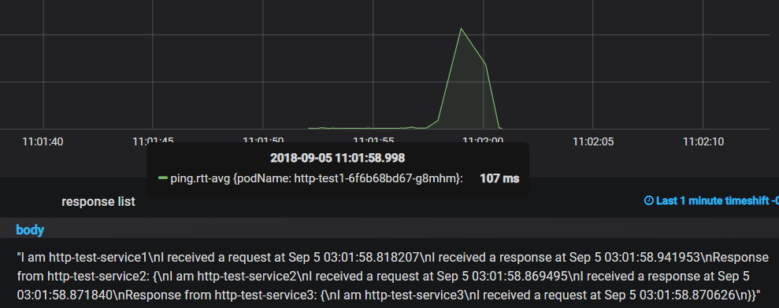
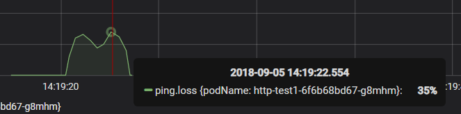
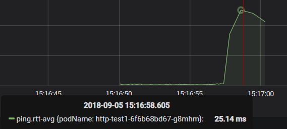

#  kube-spy 功能测试用例（基于配置文件）

本测试用例目标为位于default命名空间的http-test服务

#### Namespace：

##### TestCase1：

- 输入：与服务实际所在不符的命名空间

- 预期输出：相应报错信息

- 配置文件：[namespace1.yaml](./testConfig/namespace1.yaml)

- 测试结果：

  通过

  ```
  Fail to get service http-test-service1 : services "http-test-service1" not found
  ```

##### TestCase2：

- 输入：空

- 预期输出：相应报错信息

- 配置文件：[namespace2.yaml](./testConfig/namespace2.yaml)

- 测试结果：

  通过

  ```
  Fail to get service http-test-service1 : an empty namespace may not be set when a resource name is provided
  ```

  

#### VictimServices-name：

##### TestCase1：

- 输入：与服务实际名称不符的名称

- 预期输出：相应报错信息

- 配置文件：[svc_name1.yaml](./testConfig/svc_name1.yaml)

- 测试结果：

  通过

  ```
  Fail to get service http-test-service? : services "http-test-service?" not found
  ```

##### TestCase2：

- 输入：空

- 预期输出：相应报错信息

- 配置文件：[svc_name2.yaml](./testConfig/svc_name2.yaml)

- 测试结果：

  通过

  ```
  Fail to get service  : resource name may not be empty
  ```

##### TestCase3：

- 输入：两次输入相同的服务名

- 预期输出：对该服务分别进行两次故障注入

- 配置文件：[svc_name3.yaml](./testConfig/svc_name3.yaml)

- 测试结果：

  通过


#### VictimServices-ChaosList：

##### TestCase1：

- 输入：空

- 预期输出：不添加chaos，正常运行

- 配置文件：[chaoslist1.yaml](./testConfig/chaoslist1.yaml)

- 测试结果：

  不通过，log中有记录，但grafana图形界面没有显示统计数据。

  *通过，在grafana的victim标签内选中none，即可显示无chaos的数据。

##### TestCase2：

- 输入：在某个服务上添加一个chaos

- 预期输出：添加chaos后正常运行

- 配置文件：[chaoslist2.yaml](./testConfig/chaoslist2.yaml)

- 测试结果：

  通过

  

##### TestCase3：

- 输入：在某个服务上添加多个chaos

- 预期输出：分多次测试每个chaos的添加影响

- 配置文件：[chaoslist3.yaml](./testConfig/chaoslist3.yaml)

- 测试结果：

  通过

  


#### VictimServices-ChaosList-replica：

##### TestCase1：

- 输入：空

- 预期输出：副本数不变，进行测试

- 配置文件：[replica1.yaml](./testConfig/replica1.yaml)

- 测试结果：

  通过

  

  

##### TestCase2-1：

- 输入：1（原本有2个副本）

- 预期输出：副本数被调整为1后进行测试，测试完成后恢复2个

- 配置文件：[replica2.yaml](./testConfig/replica2.yaml)

- 测试结果：

  通过，测试过程中副本数为1，测试完成后副本数为2

  

##### TestCase2-2：

- 输入：1（原本就是1个副本）

- 预期输出：直接进行测试

- 配置文件：[replica2.yaml](./testConfig/replica2.yaml)

- 测试结果：

  通过

  

##### TestCase3-1：

- 输入：3（原本有3个以上副本）

- 预期输出：副本数被调整为3后进行测试

- 配置文件：[replica3.yaml](./testConfig/replica3.yaml)

- 测试结果：

  通过

  

##### TestCase3-2：

- 输入：3（原本有1个副本）

- 预期输出：副本数被调整为3后进行测试

- 配置文件：[replica3.yaml](./testConfig/replica3.yaml)

- 测试结果：

  通过

  

  

#### VictimServices-ChaosList-range：

##### TestCase1：

- 输入：空

- 预期输出：所有副本都被添加chaos

- 配置文件：[range1.yaml](./testConfig/range1.yaml)

- 测试结果：

  通过

  

##### TestCase2：

- 输入：2（replica为3）

- 预期输出：副本数被调整为3后，对前两个pod添加了chaos进行测试

- 配置文件：[range2.yaml](./testConfig/range2.yaml)

- 测试结果：

  通过

  

##### TestCase3：

- 输入：50%（replica为3）

- 预期输出：副本数被调整为3后，对第一个（取下整）pod添加了chaos进行测试

- 配置文件：[range3.yaml](./testConfig/range3.yaml)

- 测试结果：

  通过

  


#### VictimServices-ChaosList-ingress/egress：

##### TestCase1：

- 输入：空

- 预期输出：所有副本都没有被添加chaos

- 配置文件：[chaos1.yaml](./testConfig/chaos1.yaml)

- 测试结果：

  通过

  

##### TestCase2：

- 输入：

  ```
  ingress: "10kbps,,"
  ```

- 预期输出：服务入口流量被限速，导致服务接受请求延时，不影响发送请求

- 配置文件：[rate1.yaml](./testConfig/rate1.yaml)

- 测试结果：

  不通过，发送和接受请求均有延时

  *通过，第一次发送请求需要通过TCP三次握手，这个过程中包括了接受TCP响应，因此同样会受到影响

  

##### TestCase3：

- 输入：

  ```
  egress: "10kbps,,"
  ```

- 预期输出：服务出口流量被限速，导致服务发送请求延时，不影响接受请求

- 配置文件：[rate2.yaml](./testConfig/rate2.yaml)

- 测试结果：

  通过

  

##### TestCase4：

- 输入：

  ```
  ingress: "10kbps,,"  
  egress: "10kbps,,"
  ```

- 预期输出：服务出入口流量均被限速，导致服务发送、接受请求延时

- 配置文件：[rate3.yaml](./testConfig/rate3.yaml)

- 测试结果：

  通过

  

##### TestCase5：

- 输入：

  ```
  ingress: ",delay,50ms" 
  ```

- 预期输出：服务入口流量被延时50ms

- 配置文件：[delay1.yaml](./testConfig/delay1.yaml)

- 测试结果：

  通过

  

##### TestCase6：

- 输入：

  ```
  egress: ",delay,50ms" 
  ```

- 预期输出：服务出口流量被延时50ms

- 配置文件：[delay2.yaml](./testConfig/delay2.yaml)

- 测试结果：

  通过

  

##### TestCase7：

- 输入：

  ```
  ingress: ",delay,50ms"  
  egress: ",delay,50ms" 
  ```

- 预期输出：服务入口和出口流量均被延时50ms

- 配置文件：[delay3.yaml](./testConfig/delay3.yaml)

- 测试结果：

  通过

  

##### TestCase8：

- 输入：

  ```
  ingress: ",loss,20%" 
  ```

- 预期输出：服务入口流量ip包随机丢弃20%

- 配置文件：[loss1.yaml](./testConfig/loss1.yaml)

- 测试结果：

  通过

  

##### TestCase9：

- 输入：

  ```
  egress: ",loss,30%" 
  ```

- 预期输出：服务出口流量ip包随机丢弃30%

- 配置文件：[loss2.yaml](./testConfig/loss2.yaml)

- 测试结果：

  通过

  

##### TestCase10：

- 输入：

  ```
  ingress: ",loss,20%"  egress: ",loss,30%" 
  ```

- 预期输出：服务入口流量ip包随机丢弃20%，出口流量ip包随机丢弃30%

- 配置文件：[loss3.yaml](./testConfig/loss3.yaml)

- 测试结果：

  通过

  

##### TestCase11：

- 输入：

  ```
  ingress: "10kbps,duplicate,10%"
  ```

   (与TestCase2进行对比)

- 预期输出：入口流量ip包10%重复，挤占带宽导致延迟进一步增大

- 配置文件：[duplicate1.yaml](./testConfig/duplicate1.yaml)

- 测试结果：

  通过

  

  

##### TestCase12：

- 输入：

  ```
  egress: "10kbps,duplicate,15%"
  ```

   (与TestCase3进行对比)

- 预期输出：出口流量ip包15%重复，挤占带宽导致延迟进一步增大

- 配置文件：[duplicate2.yaml](./testConfig/duplicate2.yaml)

- 测试结果：

  通过

  

  

##### TestCase13：

- 输入：

  ```
  ingress: "10kbps,duplicate,10%" 
  egress: "10kbps,duplicate,15%"
  ```

   (与TestCase4进行对比)

- 预期输出：入口、出口流量ip包重复，挤占带宽导致延迟进一步增大

- 配置文件：[duplicate3.yaml](./testConfig/duplicate3.yaml)

- 测试结果：

  通过

  

  

##### TestCase14：

- 输入：

  ```
  ingress: ",delay,50ms,reorder,80%"
  ```

   (与TestCase5进行对比)

- 预期输出：入口流量ip包80%直接通过，20%延时50ms，最终花费时间小于TestCase5，大于TestCase1

- 配置文件：[reorder1.yaml](./testConfig/reorder1.yaml)

- 测试结果：

  通过

  

  

##### TestCase15：

- 输入：

  ```
  egress: ",delay,50ms,reorder,70%" 
  ```

  (与TestCase6进行对比)

- 预期输出：出口流量ip包70%直接通过，30%延时50ms，最终花费时间小于TestCase6，大于TestCase1

- 配置文件：[reorder2.yaml](./testConfig/reorder2.yaml)

- 测试结果：

  通过

  

  

##### TestCase16：

- 输入：

  ```
  ingress: ",delay,50ms,reorder,80%"  
  egress: ",delay,50ms,reorder,70%" 
  ```

  (与TestCase7进行对比)

- 预期输出：入口流量ip包80%直接通过，20%延时50ms，出口流量ip包70%直接通过，30%延时50ms，最终花费时间小于TestCase7，大于TestCase1

- 配置文件：[reorder3.yaml](./testConfig/reorder3.yaml)

- 测试结果：

  通过

  

  

##### TestCase17：

- 输入：

  ```
  ingress: ",corrupt,50%"
  ```

   (与TestCase1进行对比)

- 预期输出：入口流量ip包50%损坏，最终http请求耗时波动较大

- 配置文件：[corrupt1.yaml](./testConfig/corrupt1.yaml)

- 测试结果：

  通过

  

##### TestCase18：

- 输入：

  ```
  egress: ",corrupt,40%"
  ```

   (与TestCase1进行对比)

- 预期输出：出口流量ip包40%损坏，最终http请求耗时波动较大

- 配置文件：[corrupt2.yaml](./testConfig/corrupt2.yaml)

- 测试结果：

  通过

  

##### TestCase19：

- 输入：

  ```
  ingress: ",corrupt,50%"  
  egress: ",corrupt,40%" 
  ```

  (与TestCase1进行对比)

- 预期输出：入口流量ip包50%损坏，出口流量ip包40%损坏，最终http请求耗时波动较大

- 配置文件：[corrupt3.yaml](./testConfig/corrupt3.yaml)

- 测试结果：

  通过

  

#### ClientSetting-retry：

##### TestCase1：

- 输入：

  ```
  - name: "http-test-service1"
    ChaosList:
    - ingress: ",delay,1000ms"
      
      
  retryCount： 0
  retryWait: 500
  retryMaxWait: 500
  timeout: 2000
  ```

- 预期输出：http请求发出后500ms，未收到请求，没有重试

- 配置文件：[retry1.yaml](./testConfig/retry1.yaml)

- 测试结果：暂无可见数据

##### TestCase2：

- 输入：

  ```
  - name: "http-test-service1"
    ChaosList:
    - ingress: ",delay,3000ms"
      
      
  retryCount： 3
  retryWait: 100
  retryMaxWait: 3000
  timeout: 3500
  ```

- 预期输出：http请求发出后100ms，未收到请求，在3s内重试三次

- 配置文件：[retry2.yaml](./testConfig/retry2.yaml)

- 测试结果：暂无可见数据

##### TestCase3：

- 输入：

  ```
  - name: "http-test-service1"
    ChaosList:
    - ingress: ",delay,3000ms"
      
      
  retryCount： 3
  retryWait: 1000
  retryMaxWait: 2000
  timeout: 3500
  ```

- 预期输出：http请求发出后1000ms，未收到请求，在2s内重试（不到3次）

- 配置文件：[retry3.yaml](./testConfig/retry3.yaml)

- 测试结果：暂无可见数据

#### ClientSetting-timeout：

##### TestCase1：

- 输入：

  ```
  - name: "http-test-service1"
    ChaosList:
    - ingress: ",delay,500ms"
      
  retryCount： 0
  timeout: 3000
  ```

- 预期输出：http请求发出后2000ms收到响应，没有超时

- 配置文件：[timeout1.yaml](./testConfig/timeout1.yaml)

- 测试结果：

  通过

  

##### TestCase2：

- 输入：

  ```
  - name: "http-test-service1"
    ChaosList:
    - ingress: ",delay,1000ms"
      
  retryCount： 0
  timeout: 200
  ```

- 预期输出：http请求发出后200ms返回超时提示

- 配置文件：[timeout2.yaml](./testConfig/timeout2.yaml)

- 测试结果：

  通过

  